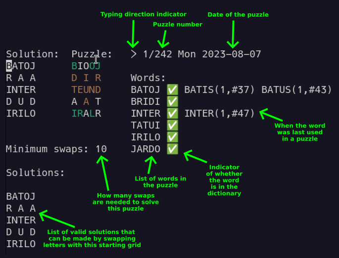

# Vaflo

Vaflo is a website for a daily word game where you have to swap letters around on a grid until all of the columns and lines form a word. It is an open source clone of [The Waffle Game](https://wafflegame.net). There are three different versions which each have their own branch in this repo:

* [Vaflo](https://vaflo.net) – in Esperanto
* [Jeu de gaufre](https://jeudegaufre.fr) – in French
* [Shawffle](https://shawffle.busydoingnothing.co.uk) – in English with the [Shavian alphabet](https://shavian.info)

## Building the website

Make sure you have a [Rust compiler](https://rustup.rs/) and [wasm-pack](https://rustwasm.github.io/wasm-pack/installer/) installed. Then you can type:

```bash
wasm-pack build --target=web
./create-dist.sh
```

Then the files needed for the website will be ready in a directory called `dist`. The game is effectively a static website so you can just copy them somewhere where a web server can see them and start using it. Note that most browsers won’t load WebAssembly from a `file:///` URL for some reason, so you can’t run the game locally without a web server.

## Adding puzzles

All of the puzzles are partially made by hand in order to ensure the words aren’t too weird and the puzzle is fun to play. There is a clunky tool to help make puzzles. You can run it with:

```bash
cargo run --release --bin=editor
```

Then you will see something like this:



In the top-left you can see the solved puzzle on the left and the initial puzzle state on the right. You can move the cursor around with the cursor keys and press `TAB` to switch between the two grids. You can type letters to change them in the grid.

Press `Ctrl+N` to start a new puzzle. You can now type letters to fill in the words. After typing a letter the cursor will move either right or down depending on the typing direction. You can press `$` to toggle this.

You can press `Ctrl+P` to do pattern matching to help you find a word. If you press it while on a letter that is only in a vertical word it will match against that, otherwise it will match against the horizontal word. It should show you a list of words that can be made by filling in the gaps where there is a `.`. In the Esperanto branch you can also use `Y` as a special letter to make it fill in any letter that can be found at the end of a word. When making an Esperanto puzzle, I find it easiest to start with the two words at the right and bottom sides of the puzzle because these need to have three of these end letters in them and there’s not that many words that can fit.

To the right of the two grids the words in the puzzle are displayed in a list with an indication of whether the word is valid or not. Next to that if the word has already been used in a puzzle the editor will show you how many puzzles have used it (first number) and which one was the last one (second number). I try to avoid reusing a word if I already used it less than a month ago. On the Shavian branch this list will also show you the most frequent spelling of the word with the Latin alphabet.

Once you have only two words left to add, put the cursor where the two words meet and press `Ctrl+X`. This will show you a list of pairs of words that have a common letter at the intersection point.

After you’ve finished designing the puzzle solution, press `TAB` to switch to the grid for the initial state. Press `Ctrl+R` to make the computer do 10 random swaps. This will give you a random starting point to work with. You can make swaps in the grid by first selecting a letter by pressing `SPACE`. Then move to the letter you want to swap with and press `Ctrl+S`. Keep doing this until the “minimum swaps” number is 10. Make sure that the puzzle looks nice and has enough yellow and green letters so that it’s not impossibly difficult. It can be nice to have at least one word with two green letters in the intersections and two yellow letters in the non-intersecting parts so that the player can make a safe swap to get started.

The grids under the title “Solutions” is a list of solutions that can be achieved by swapping letters from the initial starting arrangement. I like to try and make the puzzle so that there’s only one solution so that in theory the player could look at the grid and plan their moves ahead of time to find the 5-star solution without actually needing the feedback from the computer.

Once you’ve finished editing the puzzle, press `Ctrl+C` to quit the editor. This will save the list of puzzles in `puzzles.txt`. If you know how to use git you could then commit this and make a pull request if you want to send the puzzle to me to help with the site.

### Checking the puzzles

Once you’ve finished editing your puzzles you might want to validate them to make sure you haven’t accidentally added a word that isn’t in the dictionary. Do this by typing:

```bash
cargo run --release --bin=check-puzzles
```

This will check that all the puzzles only have valid words, no word has been used twice in the same puzzle, the minimum swaps needed to solve it is 10 and that there are no other valid solutions from the starting grid.

### Key summary

| Key         | Action |
|-------------|--------|
| Cursor keys | Move the cursor around |
| A-Z or .    | Type a letter |
| Backspace   | Move the cursor backwards |
| TAB         | Toggle between the two grids |
| $           | Toggle the typing direction |
| SPACE       | Select a letter in the puzzle grid |
| Ctrl+S      | Swap the letter under the cursor with the selected letter |
| Ctrl+C      | Save the puzzles and quit the editor |
| Ctrl+R      | Make ten random swaps in the puzzle grid |
| Ctrl+N      | Start a new puzzle |
| Ctrl+P      | Search for words matching the pattern under the cursor |
| Ctrl+X      | Look for words that share a common letter at the intersection under the cursor |
| Ctrl+V      | Remove words from search results that have been used in the last 30 days. On the Shavian branch this also removes words that have ever been used twice. |
| Ctrl+J      | Shuffle the search results (jumble up) |
| Ctrl+G      | Generate a random puzzle |
| Page up     | Move to the previous puzzle |
| Page down   | Move to the next puzzle |
| Home        | Move to the first puzzle |
| End         | Move to the last puzzle |
